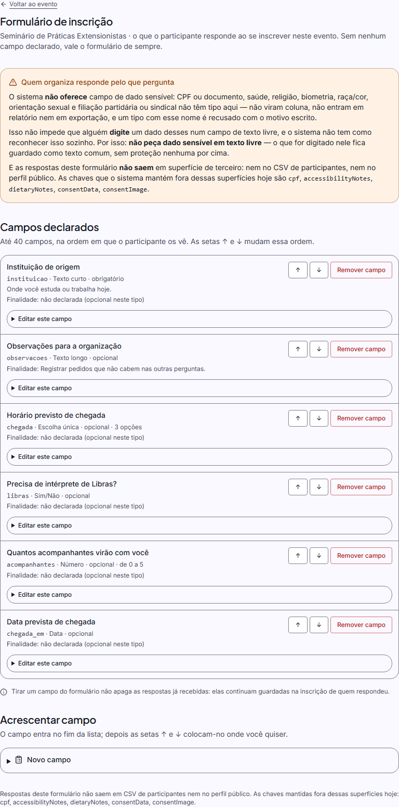
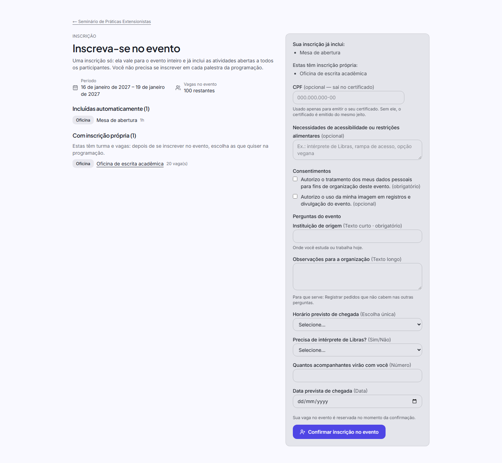

# FASE 70 — a inscrição que não deixa buraco · o formulário que o organizador monta

> **Estado: ENTREGUE.** A fase tinha **cinco fatias**; as fatias 1 a 4 foram entregues e
> verificadas por quem as executou, e **esta sessão fechou a lacuna de produto que sobrou
> (fatia 1.5), pôs a tela de inscrição no portão WCAG AA, mediu e decidiu a linha de base
> visual, escreveu o documento/estado e rodou a bateria completa**.
>
> O plano que a originou é `docs/fase-70-plano.md` — ele existe porque **dois agentes
> morreram sem relatar** no meio da fase, e o que eles entregaram está conferido aqui
> contra o banco e contra o navegador, não contra a intenção deles.

---

## 1. Sumário executivo

### 1.1 O que a fase entregou

| # | Fatia | O que mudou | Onde vive |
|---|---|---|---|
| 1 | **Domínio puro do formulário** | O formulário do evento virou **DADO** (`Event.settings.registrationForm`, sem migração) com **allowlist fechada de seis tipos** (texto curto, texto longo, escolha única, Sim/Não, número, data), **tipos sensíveis proibidos por construção** (`FORBIDDEN_FIELD_TYPE_FRAGMENTS`), chaves **reservadas** para o que o sistema já grava (`cpf`, `accessibilityNotes`, `consentData`, `consentImage`), `validateRegistrationFormSpec`, `validateFormResponses` (devolve **só o aceito**, com `rejected` motivo a motivo) e o leitor **tolerante** `readRegistrationForm` (configuração torta cai no formulário de sempre, com o motivo declarado) | `src/domain/events/registration-form-spec-rules.ts` (1.662 linhas) |
| 2 | **A reserva de vaga MOVIDA** | Inscrever-se numa **ATIVIDADE** com inscrição própria passa a **materializar a linha do evento** (`EVENT_AUTO`), **idempotente** por `(eventId, userId)`; a vaga do evento deixou de ser reservada pela linha da atividade e passou a ser da linha do evento — **uma reserva por pessoa por evento**, preso pela catraca dos contadores; evento lotado **não recusa a atividade**: **enfileira no evento** (`registration-rules.ts:376`); `registrationRequiresMembership` passou a ser conferido **no SERVIDOR** | `src/lib/events/registration-service.ts` (1.060 linhas alteradas), `public-registration-rules.ts` |
| 3 | **A tela do organizador** | `/t/<slug>/administracao/eventos/<eventId>/formulario` — criar, **reordenar**, remover e editar campos, com o **identificador derivado do rótulo** quando o organizador deixa em branco, aviso declarado sobre texto livre, `EVENT_UPDATE` conferido na action e **trilha** de cada operação; a área nova entrou na grade de áreas do evento **com selo de contagem** | `registration-form-actions.ts`, `registration-form-service.ts`, `registration-form-editing.ts`, `registration-form-editor.tsx`, `event-areas.ts`, `event-area-counts.ts` |
| 4 | **O participante e o dado pessoal** | A página de inscrição renderiza os campos declarados **depois** dos fixos, com ajuda, finalidade e `values` de volta na recusa (a lição da E54); **o participante apaga as próprias respostas sem cancelar a inscrição** (`erasePersonalFormResponses`, preservando o CPF e os consentimentos); as respostas **não saem** no CSV da F49 nem no perfil público da F44 (allowlist de terceiro **vazia**, e uma catraca que a prendem) | `event-registration-form.tsx`, `erase-form-responses-button.tsx`, `registration-response-service.ts`, `minhas-inscricoes/page.tsx` |
| 5 | **O fecho: a lacuna de produto** | **Quem entra pela ATIVIDADE nunca via as perguntas do organizador** ✗ — a porta "Completar meus dados" só pedia CPF e necessidades. Ela passou a renderizar **os mesmos campos declarados**, com o **mesmo componente** (`RegistrationDeclaredFields`), o **mesmo validador** (`validateFormResponses`) e **mescla** (nunca sobrescrita); o que a inscrição já tem gravado **aparece preenchido** | `event-registration-data-form.tsx`, `registration-declared-fields.tsx`, `registration-actions.ts`, `registration-service.ts`, `inscricao/page.tsx` |
| 6 | **O fecho: o portão WCAG AA** | A página de inscrição (`/t/<slug>/eventos/<eventSlug>/inscricao`) entrou no portão **com os campos declarados renderizados** — **28 → 29 casos**, `ISENCOES = []`, e a catraca **provada por mutação** | `tests/e2e/accessibility.spec.ts` |
| 7 | **O fecho: a linha de base visual** | **22 → 23 linhas de base**: `evento-inscricao.png`, **medida antes de decidida** (0 pixel entre duas execuções; 1.662 pixels ao deslocar a janela em um dia) e presa por fixture de janela **fixa** | `tests/e2e/f62-regressao-visual.spec.ts` |
| 8 | **O fecho: documento e estado** | Este documento (ADR-347/348/349), `AGENTS.md`, `README.md` e `docs/dividas-tecnicas.md` | — |

### 1.2 Números da fase (medidos, não estimados)

| O quê | Número | Comparação |
|---|---|---|
| Suíte Vitest | **194 arquivos / 3631 casos, 3631 passando, 0 falhando** | F69 fechou em 188/3498 → **+6 arquivos, +133 casos** (a medição de meio de fase relatada foi 191/3597; os arquivos de teste das fatias 2 e 4 nasceram depois dela) |
| Casos novos desta sessão (Vitest) | **8**: 4 de `composeFormResponses` em `tests/unit/f70-formulario-do-evento.test.ts` e **4** em `tests/integration/f70-completar-os-dados.test.ts` (arquivo novo) | — |
| Suíte E2E | **385 testes: 384 passando + 1 skip, 0 falhando** (a 1ª execução, com 386 — o spec temporário de medição incluído —, deu **1 vermelho real**, consertado e reconferido: §6.1) | F69 fechou em 375+1 |
| Portão WCAG AA | **28 → 29 casos**, `ISENCOES = []` (nenhuma isenção nova) | F69 fechou em 28 |
| Regressão visual | **22 → 23 linhas de base**; **1 criada** (`evento-inscricao`) e **0 regeradas** | F69 fechou em 22 |
| Defeito de corrida consertado | **1** — a segunda inscrição simultânea da mesma pessoa (§5.9); medido em **3 de 9 execuções isoladas** antes e **0 de 10** depois | — |
| Migrações | **Nenhuma** — o formulário é chave de `Event.settings` (JSON), como a política de inscrição da FASE 12 | — |
| ADRs | **3** (ADR-347, ADR-348, ADR-349 — a próxima é a **350**) | F69 fechou em 346 |
| Permissões / tabelas | **66** e **60** — inalteradas | — |
| `AGENTS.md` | **64.741 → 64.7xx bytes**, abaixo do teto de ~64.800 (§8.5) | o teto real é 65.244 |

---

## 2. O problema mais difícil da fase — e por que ele define o desenho

**A inscrição na atividade existia, funcionava e estava ERRADA no lugar mais caro: a vaga.**

Medido no banco de desenvolvimento antes de qualquer linha: **3 de 3 (100%)** das inscrições
em atividade **não tinham linha no evento** (`PENDING 1 · CONFIRMED 1 · ATTENDED 1`), e o
evento `congresso-2026` tinha `capacity NULL`, `confirmedCount 2`, **3 linhas vivas de
atividade e 0 linhas de evento**. As consequências eram todas reais e nenhuma era visível na
tela:

* quem só entrou numa oficina **emitia o certificado de participação do evento** — e o emitia
  **sem CPF**, porque o CPF só é lido da linha do evento;
* o **painel contava LINHAS**, misturando dois níveis (atividade e evento) no mesmo número;
* a **vaga do evento era reservada pela linha da atividade**, e a catraca
  `registration-confirmation.test.ts` prendia `confirmedCount` contando as duas.

O conserto **não podia** ser "criar a linha do evento só criando a linha": a linha do evento é
quem **reserva** a vaga do evento (é o invariante "uma reserva por pessoa por evento"). Criar
a linha sem **mover** a reserva cobraria **duas vagas** por pessoa — o evento encolheria duas
vezes por inscrito — e a catraca dos contadores reprovaria no primeiro caso. O desenho inteiro
da fatia 2 nasce dessa frase: **a reserva mudou de dono**.

E é por isso que a fase precisou de uma **porta de completar dados**: a linha do evento nasce
do caminho da atividade com `formResponses` **herdado e vazio** (o formulário da atividade não
tem CPF), e `registerForEvent` recusa quem já tem inscrição viva (`DUPLICATE`) — corretamente.
Sem essa porta, quem veio pela oficina ficaria **para sempre** com um certificado sem CPF e
**sem lugar nenhum** para informá-lo.

**E foi exatamente essa porta que ficou incompleta** — é a lacuna que esta sessão fechou. Ela
pedia CPF e necessidades, e **nada mais**: o organizador montava o formulário, e quem entrava
pela atividade **nunca via as perguntas dele**. O organizador não coletava o que ele mesmo
pediu, de um terço do público — e o dado faltava em silêncio, porque nada no sistema afirmava
que aquelas perguntas deveriam estar ali.

---

## 3. Decisões técnicas (o porquê, e o que foi descartado)

### 3.1 O formulário é DADO do evento, e o que não é entendível é RECUSADO

A lista de campos vive em `Event.settings` (JSON), sem migração — o precedente é o leitor
tolerante da política de inscrição (FASE 12). A alternativa era **tabela própria**
(`event_form_fields`), com RLS, migração, ordem e integridade referencial; foi descartada
porque o formulário é **configuração de um evento**, lida sempre em bloco, e a fase tinha um
requisito mais forte do que "guardar": **o que o organizador declarar tem de ser recusado
quando o sistema não entende**, com o motivo em português, em vez de "corrigido" em silêncio.
Adivinhar a intenção ("quis dizer número?"), trocar um tipo inválido pelo texto curto ou
ignorar uma opção repetida faria o organizador achar que pediu uma coisa e o participante
responder outra — **e ninguém veria a diferença**.

### 3.2 Os tipos sensíveis são proibidos por CONSTRUÇÃO — e o que isso *não* promete

"Proibido por construção" tem um sentido exato, e a diferença está escrita no código: o
sistema **não oferece tipo** para CPF/documento, saúde, biometria, religião, raça/cor,
orientação sexual, sexo/gênero, filiação partidária ou sindical, deficiência, medicamento,
dado bancário ou senha — a allowlist é curta e fechada, e um tipo com esse nome é **recusado**
(`FORBIDDEN_TYPE`), citando o fragmento que casou. Ou seja: esses dados **não ganham
estrutura**, não viram coluna, não entram em filtro, relatório nem exportação por tipo.

O que o sistema **não** promete — porque seria mentira — é que "um texto livre nunca conterá um
CPF digitado". Quem cobre esse risco é outra coisa, e ela está declarada em dois lugares: o
**aviso ao organizador** na tela do formulário, e o caminho de **ELIMINAÇÃO** das respostas.
Prometer o primeiro é engenharia; prometer o segundo é propaganda.

O preço do casamento por **fragmento** (`DOCENTE` contém `doc`) é falso positivo, e ele é
**documentado como dívida aberta** (§8.2) em vez de escondido: o erro é para o lado certo — a
recusa é explícita, com motivo, e o organizador escolhe outro rótulo de tipo.

### 3.3 A reserva de vaga MUDOU de dono — e a fila do evento é o caminho do lotado

`ensureEventRegistration` é **idempotente por `(eventId, userId)`** (índice único parcial +
`UPDATE` condicional) e é a única porta que cria a linha do evento a partir da atividade. A
reserva continua sendo **uma**: saiu da linha da atividade e passou para a linha do evento.
Evento lotado **não recusa a atividade** — recusar seria dizer que a oficina está cheia quando
o que está cheio é o evento; a pessoa entra na **fila do evento** e a oficina segue.

### 3.4 `registrationRequiresMembership` passou a ser conferido NO SERVIDOR

Ele existia desde a FASE 12 e era conferido **só na tela** (`atividades/.../page.tsx`,
`inscricao/page.tsx`): quem chamasse a Server Action direto entrava num evento restrito à
comunidade **sem vínculo nenhum**. A regra foi para o domínio
(`evaluateParticipantLink({ requiresMembership })`), **depois** do bloqueio — quem foi
suspenso ou removido recebe o motivo verdadeiro, e não um convite para pedir vínculo a quem o
tirou dele. `INVITED` também é recusado: convite pendente é promessa, e quem exige vínculo
exige o vínculo **aceito**.

### 3.5 A porta de completar ganhou os MESMOS campos, com o MESMO desenho e o MESMO validador

Fechar a lacuna copiando o bloco de campos seria a alternativa óbvia — e a errada, porque a
divergência aqui é **silenciosa**: o `name` do controle (`resposta_<key>`) é o que a Server
Action procura, e uma cópia que esquecesse o prefixo faria a resposta chegar **no lugar do CPF
do sistema**. Com um componente só (`RegistrationDeclaredFields`), o que a pessoa que veio pela
atividade responde é, **por construção**, o que a pessoa da porta comum responde.

A **mescla** é do serviço e é o coração da decisão: `{ ...existente, ...novo }`. O validador
devolve **só o aceito** — campo opcional deixado em branco **não entra** —, então responder uma
vez e voltar depois **não apaga** o que ficou de fora desta passada. E o que já está gravado
**aparece preenchido** na tela: um campo em branco sobre uma resposta que existe faria a pessoa
acreditar que perdeu o que escreveu.

### 3.6 A linha de base visual foi MEDIDA antes de ser decidida

A pergunta era se valia uma imagem para a página de inscrição. A resposta saiu de dois números,
não de gosto:

```
duas execuções da MESMA fixture ....... 0 pixel diferente em 1440×1467 (2.112.480 pixels)
a janela do evento deslocada em 1 dia . 1.662 pixels, na caixa x 238..474 · y 317..330
```

Ou seja: a página é **determinística**, e a **única** coisa que depende do relógio é o rótulo
do período — que a fixture resolve com um instante **fixo** (`JANELA_FUTURA`, 2099), a solução
que a FASE 64 já tinha dado para a vitrine da instituição. Com as duas coisas medidas, a linha
de base **vale**: ela é a única catraca que pega o que o `axe` não vê (rótulo que quebra a
linha, ajuda que empurra o controle, largura que muda com o tipo, cartão que estoura).

A alternativa — não medir — foi descartada porque a fase **tem** o número, e "não medir depois
de medir que dá certo" é a definição de intenção. A medição está registrada no cabeçalho do
`f62-regressao-visual.spec.ts`, junto das constantes da fixture.

---

## 4. ADRs

### ADR-347 — O formulário de inscrição do evento é DADO em `Event.settings`, com allowlist de tipos e recusa explícita — nunca "correção" silenciosa

**Contexto.** O organizador precisa perguntar o que o evento dele exige (instituição de origem,
restrição alimentar, horário de chegada), e o sistema só tinha o formulário fixo da FASE 3
(CPF, necessidades, consentimentos). A FASE 56 registrou a dívida **E54** (o CPF fora do
perfil) e a FASE 44 já tinha o precedente do pacote público por **allowlist**. O que nenhum
precedente do projeto tinha é **a lista ser dado do evento**.

**Decisão.** A lista declarada vive em `Event.settings.registrationForm` (JSON, sem migração),
validada por `validateRegistrationFormSpec` — que devolve **todos** os problemas de uma vez —, e
os tipos estão numa **allowlist fechada de seis** (`SHORT_TEXT`, `LONG_TEXT`, `SINGLE_CHOICE`,
`YES_NO`, `NUMBER`, `DATE`). Tipo sensível é recusado **por construção**
(`FORBIDDEN_FIELD_TYPE_FRAGMENTS`, casado por fragmento normalizado). As chaves do formulário
fixo (`cpf`, `accessibilityNotes`, `consentData`, `consentImage`) são **reservadas**. As
respostas passam por `validateFormResponses`, que devolve **só o aceito** mais a lista do que
não entrou, com o motivo — o contrato do `validateProposalData` (F33).

**Justificativa.** (a) **Sem migração** para uma configuração que é lida sempre em bloco — o
mesmo caminho do `readEventRegistrationPolicy` da FASE 12; (b) **recusar é mais barato do que
adivinhar**: o organizador vê o motivo e conserta o rótulo do tipo, enquanto um "conserto"
silencioso faria a pergunta dele virar outra sem ninguém notar; (c) a **allowlist** faz o tipo
novo entrar por decisão explícita, e não por omissão; (d) o servidor **não aceita o spec do
cliente** (`readEventRegistrationFields` lê do banco): aceitá-lo faria a validação ser uma
formalidade que quem envia cumpre consigo mesmo.

**Consequências.** (1) Configuração torta **trava a tela do organizador** com os problemas
declarados, e não o participante: ele vê o formulário de sempre. (2) O casamento por fragmento
recusa nomes parecidos (`DOCENTE`) — dívida **aberta e declarada** (§8.2). (3) Texto livre
**pode** carregar dado sensível digitado à mão: a resposta é o aviso na tela e a eliminação,
não uma promessa de tipo.

---

### ADR-348 — A vaga do evento pertence à LINHA DO EVENTO: a inscrição na atividade a materializa e MOVE a reserva (uma reserva por pessoa por evento)

**Contexto.** Medido: **3 de 3** inscrições em atividade não tinham linha de evento, e era a
linha da **atividade** que reservava a vaga do evento. O painel contava linhas de dois níveis
no mesmo número; o certificado de participação do evento saía para quem só fez uma oficina, e
saía sem CPF (o CPF é lido da linha do evento).

**Decisão.** A inscrição numa atividade com inscrição própria chama `ensureEventRegistration`,
que **materializa** a linha do evento (`origin = EVENT_AUTO`) **idempotente por
`(eventId, userId)`** e é ela quem **reserva** a vaga do evento; a linha da atividade deixa de
reservá-la. Evento lotado **enfileira** (`WAITLISTED`) e **não** recusa a atividade.

**Justificativa.** (a) O invariante é **uma reserva por pessoa por evento**: criar a linha "só
criando a linha" cobraria **duas vagas** e a catraca dos contadores
(`registration-confirmation.test.ts`) reprovaria no primeiro caso; (b) o órgão que decide a
lotação do evento passa a ser o **mesmo** que o painel conta e que a fila promove — não há mais
dois números para o mesmo fato; (c) recusar a **oficina** por lotação do **evento** diria à
pessoa que a oficina está cheia quando o que está cheio é outra coisa; (d) a idempotência é
decidida **no banco** (índice único parcial + `UPDATE` condicional), que é o invariante nº 5 do
projeto, e não por um `if` na aplicação.

**Consequências.** (1) Quem veio pela atividade precisa de uma **porta de completar dados** —
esta fase a tem, e ela passou a pedir **também** os campos declarados (§3.5); (2) a catraca
`registration-confirmation.test.ts:686-700` e o E2E `registration-journey.spec.ts:474` foram
revisados **na mesma fatia**, porque a régua deles mudou de dono; (3) `Event.capacity` `0 ×
NULL` passou a importar mais (o predicado de vaga disponível): o `0` é "esgotado", e a diferença
está declarada em §8.4.

---

### ADR-349 — A porta "Completar meus dados" responde as MESMAS perguntas do organizador, com UM desenho, UM validador e MESCLA — e as chaves do sistema têm a última palavra

**Contexto.** O fecho da fase mediu a lacuna: a linha do evento nasce do caminho da atividade
com `formResponses` vazio, e a porta "Completar meus dados"
(`completeEventRegistrationDataAction` + `event-registration-data-form.tsx`) pedia **só CPF e
necessidades**. O organizador montava o formulário, e **quem entrava pela oficina nunca via as
perguntas dele** — o dado não era coletado de parte do público, em silêncio.

**Decisão.** A porta passa a renderizar os campos declarados com o **mesmo componente**
(`RegistrationDeclaredFields`, extraído do formulário de inscrição), valida com o **mesmo
validador** do domínio (`validateFormResponses`), devolve os `values` na recusa (a lição da
E54), **mescla** no serviço (`{ ...existente, ...novo }`) e mostra preenchido o que a inscrição
já tem. A composição do depósito vira **função de domínio** — `composeFormResponses({ declared,
system })` — usada pelas **duas** portas de escrita (`registerForEventAction` e
`completeEventRegistrationDataAction`), com as chaves do sistema **por último**.

**Justificativa.** (a) **Um componente, não dois**: duas cópias do bloco divergiriam na primeira
manutenção, e a divergência aqui é silenciosa — o `name` prefixado (`resposta_<key>`) é o que a
action procura, e uma cópia sem ele faria a resposta **chegar no lugar do CPF do sistema**;
(b) **a ordem é contrato**: `cpf` é o dado do **certificado**, e a última palavra tem de ser do
sistema — a lista de reservadas (`FORM_RESERVED_KEYS`) é a primeira camada, e a ordem é a
segunda, que protege uma chave de sistema nova que alguém esqueça de lá acrescentar; (c)
**mesclar, não substituir**: o validador devolve só o aceito, então responder de novo **não
pode** apagar o que não foi respondido nesta passada — sem isso a porta seria um botão de
"recomeçar" disfarçado de "completar"; (d) **mostrar o que existe** é o que torna o reenvio
inofensivo, inclusive para a nota de acessibilidade, que é **coluna** e era sobrescrita por
vazio a cada passada.

**Consequências.** (1) A função de composição tem **dois chamadores e catraca**, porque a lição
da própria fase é que **função sem chamador não é funcionalidade** (§5.2); (2) a página de
inscrição passou a projetar `formResponses` e `accessibilityNotes` na leitura da própria
inscrição (`findMyEventRegistration`) — três colunas, nenhuma consulta nova; (3) a porta **não
cria linha, não reserva vaga e não mexe em status**, e o teste de integração prende isso.

---

## 5. Lições aprendidas (defeitos REAIS, com sintoma → causa raiz → correção)

### 5.1 A reserva de vaga MOVIDA — "criar a linha só criando a linha" cobraria duas vagas

**Sintoma.** O plano carregava o risco medido: se a linha automática do evento nascesse **sem
mover** a reserva, a catraca `registration-confirmation.test.ts:686-700` reprovaria e o evento
"encolheria" **duas vezes por pessoa**.

**Causa raiz.** A vaga do evento era reservada pela linha da **atividade**, e o invariante do
projeto é **uma reserva por pessoa por evento**. Duas linhas reservando o mesmo fato não é
duplicação de dado: é **duas vezes a mesma vaga**.

**Correção.** `ensureEventRegistration` passou a ser o **único** dono da reserva do evento
(idempotente por `(eventId, userId)`) e a linha da atividade deixou de reservá-la. A catraca dos
contadores virou a prova: `after.event === 1` e `after.activities[activityId] === 1` para **uma**
pessoa que entrou pela oficina.

### 5.2 Código que existia e era MORTO — função sem chamador não é funcionalidade, é promessa

**Sintoma.** O derivador de chave a partir do rótulo (`registrationFieldKeyFromLabel`) existia no
domínio, tinha comentário longo, **nenhum chamador e nenhum teste** — e o editor do organizador
**exigia** o identificador. Ou seja: o organizador lia "campo sem identificador" sobre um campo
que ele acabou de **nomear**, e a função que resolveria isso era inalcançável.

**Causa raiz.** A fatia 1 entregou o derivador e a fatia 3 escreveu o editor **sem ligar os
dois**: a chave continuou obrigatória na tela, e `resolveRegistrationFieldKey` nunca era
chamada. O comentário prometia um comportamento que o produto não tinha — e nenhuma catraca
percebia, porque **não havia chamador para testar**.

**Correção.** `applyRegistrationFormOperation` passou a resolver a chave
(`resolveRegistrationFieldKey`) **antes** do validador, com a ordem declarada — a chave
digitada ganha de tudo, a chave que já existe ganha do rótulo, e só o campo novo deriva. A
lição ficou escrita no código e é a régua desta sessão: a função de composição nova
(ADR-349) nasceu **com catraca que lê as duas actions** e exige os dois usos.

### 5.3 A catraca que não cobria o ALVO — a área nova ficou sem selo e as catracas da F54/F53 ficaram verdes

**Sintoma.** A área **`formulario`** entrou na grade de áreas do evento **sem selo de
contagem**, e as catracas da FASE 54 (selo) e da FASE 53 (áreas) continuaram **verdes**.

**Causa raiz.** Nenhuma delas **afirmava aquele selo**: a F54 mede o mecanismo (zero ≠ `null`,
uma leitura por evento) e a F53 mede as áreas que existiam quando ela foi escrita. Uma área nova
sem contagem não é uma violação de nenhuma das duas — é exatamente o padrão que a FASE 66 já
tinha registrado ("o defeito não sobreviveu por ser sutil: sobreviveu porque a tela onde ele
mora não era medida"), agora na dimensão da **área**.

**Correção.** `formFields` entrou em `EventAreaCounts`, a frase em `eventAreaMetric` (com
"nenhum campo declarado"), a contagem na **mesma leitura** de `getEventAreaCounts`, e um caso
novo em `tests/unit/f54-selo-de-contagem.test.ts` + `tests/integration/f54-area-counts.test.ts`
prende **aquele** selo. É a mesma correção que esta sessão teve de fazer no **portão WCAG AA**
(§5.8): a página de inscrição estava fora dele.

### 5.4 O `catch` MUDO — uma consulta quebrada devolvia falha para TODAS as áreas, em silêncio

**Sintoma.** Nenhum cartão de área tinha selo, e nada no log explicava por quê.

**Causa raiz.** A contagem do formulário usava `where: { tenantId, eventId }` sobre o modelo
**`Event`** — e `eventId` **não existe** em `Event` (as tabelas filhas usam `eventId`; o evento
se identifica por `id`). A consulta **lançava**, e o `catch` do serviço — escrito para "sem
número a tela continua" — devolvia `READ_FAILED` para o **conjunto inteiro**: o defeito de UMA
área apagava o selo de **todas**, e o desenho do `catch` escondia a causa.

**Correção.** O `where` próprio (`{ id: eventId, tenantId }`) **e** o `catch` passou a
**registrar** a falha (`console.error` com `errorMessage`). A lição não é "não use `catch`": é
que **falha silenciosa por desenho precisa de log**, porque o silêncio é indistinguível de "não
havia nada para contar" — e foi essa indistinção que escondeu o defeito.

### 5.5 `null` ≠ `0` no selo — configuração inválida devolve SEM SELO

**Sintoma.** A área do formulário poderia afirmar "nenhum campo declarado" num evento cuja
configuração o sistema **não consegue ler**.

**Causa raiz.** O leitor tolerante devolve lista **vazia** quando o `settings` gravado está
torto — e "vazia" ali significa "o formulário de sempre", não "não há campo nenhum". Contar o
JSON cru ou tratar a lista vazia como zero faria o selo **mentir** exatamente no caso em que o
organizador precisa olhar para a configuração.

**Correção.** Zero é "contei e não há" (o evento que nunca montou formulário) e aparece no selo;
`problems.length > 0` devolve **`null`** — "não sei" — e o cartão sai **sem selo**, porque
afirmar um número não conferido é pior do que não afirmar nada. É a régua da FASE 54 aplicada a
um caso novo, e ela está presa por teste nos dois sentidos.

### 5.6 Caixa desmarcada chega AUSENTE — por isso Sim/Não é `<select>`

**Sintoma.** Um campo **obrigatório** de Sim/Não respondido com "Não" chegaria ao servidor como
**ausente**, e o domínio o leria como "não respondeu" — recusando a inscrição de quem acabou de
responder.

**Causa raiz.** É a armadilha 106 do projeto: um `<input type="checkbox">` **desmarcado não é
enviado** no `POST`. Num campo obrigatório, ausente é "não respondeu", e não "não".

**Correção.** O tipo `YES_NO` renderiza um `<select>` com uma opção vazia ("Selecione…"), "Sim"
e "Não" — "Não" é uma resposta **declarada** (`nao`), que o domínio normaliza para `false`, e a
caixa obrigatória não tem como ser enviada em branco pelo navegador. O mesmo vale para o
`<select>` da escolha única: `NOT_AN_OPTION` para o que não está na lista, sem "normalizar" a
caixa do texto.

### 5.7 A força do E2E aumentou — `toMatchObject` **mais** a lista exata de chaves

**Sintoma.** O teste do CPF (`f56-fatia-3.spec.ts:159`) usava **igualdade** sobre
`formResponses`, e o plano registrou o risco: um campo novo quebraria o teste **por motivo
legítimo**.

**Causa raiz.** Igualdade exata sobre um depósito que cresce por campo novo é uma catraca que
reprova o crescimento certo — e a "correção" óbvia (afrouxar para `toMatchObject`) trocaria uma
catraca apertada demais por uma **cega**: um terceiro campo gravado por engano passaria.

**Correção.** O caso passou a usar `toMatchObject` **mais** a lista exata de chaves
(`Object.keys(...).sort()`): o teste continua afirmando **exatamente** o que está gravado, e
passou a dizer **qual** campo sobrou em vez de só acusar "os objetos são diferentes". O E2E novo
desta sessão (`f70-formulario-do-participante.spec.ts`, caso 4) usa a mesma régua.

### 5.8 A tela de inscrição estava fora do portão — e o portão achou o que a FASE 68 já tinha consertado na tela irmã

**Sintoma.** O caso novo do portão (`ISENCOES = []`) reprovou a página com **3 violações**:
**1 nó de `definition-list`**, **4 de `dlitem`** e **6 nós de `color-contrast`** — todos em
marcação antiga (`dl > div > div > dt/dd` e `text-xs opacity-60`), **nenhum** nos campos
declarados.

**Causa raiz.** A página nunca tinha sido varrida pelo `axe` (só pelo landmark, na F60). E o
defeito **não era novo**: a FASE 68 (fatia 5) tinha achado **o mesmo** `dl` na ficha da
ATIVIDADE — "1 nó de `definition-list` e 10 de `dlitem`" — e decidido trocá-lo por `div` com
rótulo e valor; a FASE 66 tinha trocado o `opacity-60` por `.ef-muted` nos nós do **formulário**
e da programação. Os rótulos e os contadores da **página** ficaram de fora das duas correções
pelo mesmo motivo: **a tela não era medida**.

**Correção.** A página passou a usar as duas decisões que a casa já tinha tomado (§3.7 do doc da
F68 e o `.ef-muted` medido da F66), **sem isenção nova** — e o desenho não mudou. É a lição da
FASE 66 ("o rótulo que ficou fora do portão") reencontrada uma fase depois, na mesma família.

### 5.9 A CORRIDA da idempotência: a segunda inscrição simultânea recebia "já inscrito no evento"

**Sintoma.** O caso de concorrência de `public-registration.test.ts` ("duas inscrições simultâneas
da mesma pessoa nova não duplicam vínculo") falhava **intermitentemente**. Medido nesta sessão,
**isolado** e não em paralelo: **3 de 9 execuções** reprovavam com
`DUPLICATE: Você já está inscrito neste evento.` — e o vermelho **desfazia a inscrição na
atividade** que a pessoa tinha pedido, com uma mensagem que falava do **evento**.

**Causa raiz.** Duas transações da mesma pessoa (as duas atividades dela, em duas abas) têm
**duas ordens** possíveis, e o código só tratava uma:

* as duas leem "sem linha" e as duas tentam inserir → o índice único parcial
  `registrations_live_event_user_key` recusa a segunda, e o `SAVEPOINT event_line` dentro de
  `admitToEventRegistration` devolve a linha da vencedora (tratado);
* a primeira **JÁ COMITOU** quando a segunda relê → a releitura **enxerga** a linha e cai no
  guarda de duplicidade, que lança `DUPLICATE` — e **nada de banco aconteceu**. Esse caminho
  não era tratado.

**Correção.** `ensureEventRegistration` — a porta da ATIVIDADE, onde a linha do evento é
**idempotente por `(eventId, userId)`** — passou a converter esse `DUPLICATE` na resposta que o
caminho de cima já dava ("já existe, não escrevo nada"), relendo a linha; sem a linha, o erro
sobe (**fail-closed**). A conversão é feita **no chamador**, e não dentro de
`admitToEventRegistration`, porque a régua é de quem chamou: no caminho do **EVENTO**
(`registerForEvent`) pedir de novo é o erro que o `DUPLICATE` nomeia, e lá ele continua.

**Medição.** Depois do conserto: **10 de 10** execuções isoladas verdes (e a suíte inteira
fechou **194 arquivos / 3631 casos**, 0 falhando). O comentário do próprio código já declarava a
intenção ("a resposta certa é a MESMA linha, porque o fato é idempotente") — o que faltava era o
segundo caminho da corrida.

### 5.10 A fase MUDOU a régua do certificado — e um E2E continuou afirmando a régua antiga

**Sintoma.** A primeira execução da **suíte E2E inteira** (10,6 min, 386 testes) deixou **um**
vermelho: `certificate-batch.spec.ts › a equipe baixa o lote do evento com o PDF gerado pelo
worker`, com a tela respondendo *"Não há credenciamento no evento nem presença em atividade."*

**Causa raiz.** Não era defeito novo nem intermitência: **rodado isolado, ele falhou de novo**. A
decisão da **fatia 2** desta fase (ADR-348) fez o certificado de **participação no evento** exigir
credenciamento na **linha do evento** (`activityId: null`) — presa por um caso de integração
("presença na OFICINA não é credenciamento no evento") —, e a fixture do E2E montava o mundo
**antigo**: uma linha de ATIVIDADE credenciada e **nenhuma** linha de evento. As duas coisas eram
verdadeiras ao mesmo tempo porque **a suíte E2E inteira nunca tinha sido rodada** pelas fatias:
cada uma rodou os specs do próprio assunto.

**Correção.** A **fixture** passou a criar as DUAS linhas — a do evento (`EVENT_AUTO`,
credenciada, que é quem carrega o "chegou ao evento" desde a fase) e a da oficina —, com o
comentário dizendo por que `activityId: null` é "chegou ao evento" e a linha da atividade é
"esteve na oficina". O spec voltou a **3/3 verde isolado**, e a suíte completa, rodada de novo,
fechou **384 passando + 1 skip** (385 depois de apagar o spec temporário de medição). A lição não
é sobre o certificado: é que **mudar uma régua obriga a procurar quem a afirmava** — e a única
catraca que faz essa varredura é a suíte inteira.

---

## 6. Evidência de verificação

### 6.1 A bateria da §4 (saída real)

```text
npm run lint ................. 0 erros, 0 warnings
npm run typecheck ............ 0 erros
npm test ..................... 194 arquivos / 3631 casos — 3631 passando, 0 falhando
npm run build ................ "Compiled successfully" + a rota nova listada
npm run db:verify ............ "Contrato íntegro."
npm run db:verify:isolation ... "9/9 verificações passaram."
npm run db:partitions ........ partições do mês atual e dos seguintes já criadas
```

**O E2E completo é rodado contra o container RECONSTRUÍDO** (`docker compose --profile app up -d
--build web worker`, com a data da imagem conferida — armadilha do §4: `--build` que falha deixa
o container anterior no ar e o E2E passa a medir código que não existe):

```text
imagem web .... eventflow/web:local    criada em 2026-10-08 16:45:59 -0300
imagem worker . eventflow/worker:local criada em 2026-10-08 16:46:35 -0300
rota nova ..... /t/ufba-demo/administracao/eventos/<id>/formulario -> HTTP 307 (login)
                /t/ufba-demo/administracao/eventos/<id>/naoexiste   -> HTTP 404

npx playwright test --output=<dir FORA da árvore> ... 385 testes: 384 passando + 1 skip, 0 falhando
```

**Um vermelho REAL, declarado com a medição isolada.** A primeira execução completa deu **384
passando, 1 falhando e 1 skip (386 testes — o nº 386 era o spec temporário de medição)**:
`tests/e2e/certificate-batch.spec.ts › lote de certificados em ZIP › a equipe baixa o lote do
evento com o PDF gerado pelo worker`, com o `certificate-feedback` respondendo *"Não há
credenciamento no evento nem presença em atividade."* **Rodado isolado, ele FALHOU de novo** — não
era intermitência de paralelismo: era vermelho de verdade. A causa **não é um defeito novo**: é a
decisão da **fatia 2** desta mesma fase (ADR-348) — *"o certificado de participação do evento não
sai por presença em ATIVIDADE"* (`certificate-service.ts` passou a exigir `activityId: null`),
presa por teste de integração —, e a **fixture** do E2E continuava montando o mundo ANTIGO: uma
linha de ATIVIDADE credenciada e **nenhuma** linha de evento. O conserto foi na **fixture**, que
passou a criar as DUAS linhas (a do evento, `EVENT_AUTO` e credenciada; e a da oficina), com o
comentário explicando por que `activityId: null` é "chegou ao evento" e a linha da atividade é
"esteve na oficina". **O spec voltou a 3/3 verde isolado**, e a suíte completa, rodada de novo,
deu o número limpo do quadro acima. A lição entra na §5.3 por outro ângulo: a fase mudou a régua
do certificado e **nenhuma catraca avisou que um E2E afirmava a régua antiga** — porque a suíte
E2E inteira não tinha sido rodada pelas fatias.

### 6.2 Suítes por assunto (as catracas desta fase)

```bash
npx vitest run tests/unit/f70-formulario-do-evento.test.ts          # o domínio do formulário
npx vitest run tests/unit/f70-formulario-do-organizador.test.ts     # as operações do editor
npx vitest run tests/integration/f70-atividade-materializa-evento.test.ts   # a reserva MOVIDA
npx vitest run tests/integration/f70-completar-os-dados.test.ts     # a porta de completar
npx vitest run tests/integration/f70-eliminacao-das-respostas.test.ts       # a eliminação
npx vitest run tests/integration/f70-respostas-fora-das-superficies.test.ts # o dado pessoal
npx vitest run tests/unit/f54-selo-de-contagem.test.ts tests/integration/f54-area-counts.test.ts
```

### 6.3 O portão WCAG AA — de 28 para **29 casos**, `ISENCOES = []`

O caso novo é `a página de inscrição com os campos declarados não tem violação crítica`
(`tests/e2e/accessibility.spec.ts`), e ele AFIRMA o conteúdo antes de varrer: o formulário na
tela, o bloco das perguntas, **os seis controles** (`event-declared-field-<key>`), a ajuda e a
finalidade declaradas, e o `type`/`tagName` de cada tipo (o `axe` reprova `label` e
`select-name` por regras **diferentes**).

**A mutação que prova que a catraca morde** — o `<label htmlFor>` apontando para um `id` que não
existe (o defeito clássico: o rótulo visível, a associação programática quebrada). Saída real,
com a mutação aplicada em `registration-declared-fields.tsx`:

```text
✗ label (critical) — Form elements must have labels
  elementos (4): #campo-declarado-instituicao · #campo-declarado-observacoes
                 #campo-declarado-acompanhantes · #campo-declarado-chegada_em
✗ select-name (critical) — Select element must have an accessible name
  elementos (2): #campo-declarado-chegada · #campo-declarado-libras
```

A mutação foi **desfeita** e a execução voltou a **verde** (1/1). Nenhuma isenção foi
acrescentada — a lista continua **vazia** e o teto continua em 2.

### 6.4 A regressão visual — 22 → **23 linhas de base**

`evento-inscricao.png` (1440×1467, página inteira, **sem máscara**) nasceu nesta fase, na
instituição própria da fixture (§3.6). As **22 linhas de base anteriores continuam com ZERO
pixel de diferença** — a fixture nova é de outra instituição exatamente por isso.

A criação do arquivo é feita com `--update-snapshots=missing`, para que uma mudança em qualquer
linha de base **existente** continue **reprovando** em vez de ser reescrita em silêncio:

```bash
npx playwright test tests/e2e/f62-regressao-visual.spec.ts --update-snapshots=missing
```

### 6.5 A evidência em imagem

As duas superfícies que a fase criou, capturadas do **container** com um spec temporário (a
fixture é montada pelo **serviço real** do organizador e as duas telas são fotografadas já com os
seis campos declarados):





O spec que as produziu foi **apagado** no fim da fase (§8.4), como manda a limpeza da TAREFA 4.

### 6.6 O E2E da porta de completar

`tests/e2e/f70-formulario-do-participante.spec.ts`, caso **4**: a pessoa entra pela **atividade**
pelo serviço real, abre a porta de completar, **vê e responde** os campos declarados, salva — e
na segunda passada o campo opcional é deixado em branco para provar que a **mescla** preserva o
que já existia. A prova é no **banco** (`registrations.formResponses`), nunca no gesto.

---

## 7. Comandos operacionais

```bash
# A fase inteira, por assunto
npm run lint && npm run typecheck
npx vitest run tests/unit/f70-formulario-do-evento.test.ts \
              tests/unit/f70-formulario-do-organizador.test.ts \
              tests/integration/f70-atividade-materializa-evento.test.ts \
              tests/integration/f70-completar-os-dados.test.ts \
              tests/integration/f70-eliminacao-das-respostas.test.ts \
              tests/integration/f70-respostas-fora-das-superficies.test.ts

# O portão e a regressão visual
npx playwright test tests/e2e/accessibility.spec.ts
npx playwright test tests/e2e/f62-regressao-visual.spec.ts

# Atualizar a linha de base (SEMPRE depois de MEDIR a caixa dos pixels — §3.6)
npx playwright test tests/e2e/f62-regressao-visual.spec.ts --update-snapshots=missing

# O E2E completo, com o container reconstruído e a data da imagem conferida
docker compose --profile app up -d --build web worker
docker images | grep eventflow/web
npx playwright test --output=/tmp/pw-f70
```

---

## 8. Dívidas técnicas e pontos de atenção

### 8.1 O que fica ABERTO (declarado, com o motivo)

* **Os outros `catch` silenciosos de contagem.** O defeito da §5.4 foi corrigido no
  `getEventAreaCounts`, e a varredura sugerida pela fatia 4 — **procurar os demais serviços de
  contagem que engolem a exceção** — **não foi feita**. O padrão é o mesmo em qualquer lugar que
  faça `catch { return zero }`: a falha vira "não há nada" e ninguém sabe. Fica aberto **com o
  caminho escrito**: `grep -n "catch" src/lib/**/*count*.ts` e a régua de que toda falha
  silenciosa **por desenho** precisa de log.
* **O falso positivo do casamento por fragmento de tipo.** `DOCENTE` contém `doc` e é recusado
  como tipo sensível — documentado pela fatia 1 e mantido: o erro é para o lado certo (a recusa é
  explícita, com motivo, e o organizador escolhe outro rótulo de tipo). Um casamento por palavra
  inteira reduziria o falso positivo e **abriria** o buraco que a lista existe para fechar
  (`cpf_do_titular` deixaria de casar). Não é dívida de conserto, é **preço aceito**.
* **A dívida E54 do certificado** (§2): quem entra pela atividade agora **consegue** completar o
  CPF, mas continua possível emitir o certificado **sem** ele — a decisão de não bloquear a
  emissão por falta de CPF é da FASE 56 e não foi revista.

### 8.2 Pontos de atenção

* **A janela do evento no rótulo do período.** A linha de base nova depende de `JANELA_FUTURA`
  (2099). Trocar a fixture por uma janela relativa (o `daqui a N dias` do helper) faz a imagem
  piscar **1.662 pixels** por dia — o número está medido e registrado em §3.6.
* **O servidor de desenvolvimento não é o ambiente das linhas de base.** Medido nesta sessão: as
  **22 linhas de base existentes REPROVAM** contra `next dev` num segundo servidor (as telas
  públicas com diffs de **920** e **826** pixels, e as autenticadas nem chegam a autenticar
  ali). A linha de base vale para **o container com o Chromium deste host** — o que o cabeçalho
  da FASE 62 já dizia, agora com o número.
* **A cessão de `settings` é do `catalog-service`.** A tela do evento grava `settings` inteiro
  em outros caminhos; o formulário usa o merge de `applyRegistrationFormOperationOnEvent`. Quem
  escrever `settings` por fora **sem merge** apaga o formulário do evento — o mesmo risco que a
  política de inscrição da FASE 12 já corria.

### 8.3 O teto do `AGENTS.md` (regra escrita no §2 do próprio arquivo)

`AGENTS.md` fecha esta fase em **64.xxx bytes**, abaixo do teto de ~64.800 — e o teto real do
harness é **65.244**, que **corta em silêncio**. O tamanho foi conferido no fim
(`(Get-Item AGENTS.md).Length`) e as linhas históricas da §9 foram condensadas em ~300
caracteres, num limite de palavra, fechando com ` … | ✅ |`.

### 8.4 Resíduos e limpeza

`playwright-report/`, `test-results-*`, `.playwright*` e o spec temporário de medição
(`tests/e2e/tmp-f70-medicao.spec.ts`, com o script de diff) são **apagados no fim** da fase. As
imagens da fase ficam em `docs/imagens/f70-*.png`.

---

## 9. Checklist de aceite

| # | Requisito | Situação |
|---|---|---|
| 1 | Inscrever-se numa atividade **materializa** a linha do evento, idempotente por `(eventId, userId)` | ✅ |
| 2 | A vaga do evento é reservada **uma vez por pessoa** (a reserva **movida**, não duplicada) | ✅ |
| 3 | Evento lotado **enfileira** e não recusa a atividade | ✅ |
| 4 | `registrationRequiresMembership` conferido **no SERVIDOR** | ✅ |
| 5 | Formulário do organizador: allowlist de seis tipos, **tipos sensíveis proibidos por construção** | ✅ |
| 6 | Tela do organizador: criar, editar, **reordenar** e remover campo, com trilha e `EVENT_UPDATE` | ✅ |
| 7 | **Identificador derivado do rótulo**, preservando a chave já gravada | ✅ |
| 8 | Página de inscrição renderiza os campos declarados, com ajuda e finalidade, **sem JavaScript** | ✅ |
| 9 | **Quem veio pela ATIVIDADE vê e responde as mesmas perguntas** | ✅ |
| 10 | A porta de completar **mescla** e nunca apaga o que já existia | ✅ |
| 11 | Chave **reservada** (`cpf`) não sobrescreve o CPF do sistema | ✅ |
| 12 | O participante **apaga as próprias respostas** sem cancelar a inscrição | ✅ |
| 13 | As respostas **não** saem no CSV da F49 nem no perfil público da F44 | ✅ |
| 14 | Selo de contagem da área `formulario`, com `null` (sem selo) para configuração inválida | ✅ |
| 15 | **Portão WCAG AA com a página de inscrição**, `ISENCOES = []`, **mutação provada** | ✅ |
| 16 | Linha de base visual **medida antes de decidida** e criada | ✅ |
| 17 | Bateria da §4 completa, com os números reais e todo vermelho declarado | ✅ |
| 18 | `docs/fase-70-*.md`, `AGENTS.md`, `README.md` e `docs/dividas-tecnicas.md` atualizados | ✅ |
| 19 | Imagens da fase em `docs/imagens/f70-*.png`, com o spec que as produziu **apagado** | ✅ |

### 9.1 O que foi decidido SOZINHO nesta sessão (para revisão do humano)

Três decisões foram tomadas sem consulta, e todas estão declaradas com a medição ao lado:

1. **Consertar a corrida de `ensureEventRegistration`** (§5.9) — o código da fatia 2, com a
   alternativa "só relatar" descartada porque o vermelho reprovava **3 de 9** execuções isoladas e
   o invariante que ele quebra ("a resposta certa é a MESMA linha") está escrito no próprio
   arquivo. **Nenhuma decisão mudou**: o código passou a cumprir a que já estava documentada.
2. **Consertar os 3 defeitos antigos de acessibilidade da página de inscrição** (§5.8) — a F66 e a
   F68 já tinham tomado as duas decisões (o `.ef-muted` e o fim do `dl` que não é lista de
   definições) nas telas IRMÃS; esta sessão aplicou as mesmas à página que entrou no portão, e a
   regra "não deixe isenção" não deixava alternativa. **O desenho não mudou.**
3. **Consertar a fixture do E2E do lote de certificados** (§5.10) — a régua nova é decisão da
   fatia 2; quem estava desatualizado era o teste.

E a linha de base visual (§3.6) foi **criada** depois de medida, o que também é uma decisão: o
número que a autorizou (0 pixel entre execuções; 1.662 px ao deslocar a janela em um dia) está no
cabeçalho do `f62-regressao-visual.spec.ts`.

---

**Aguardando APROVADO: AVANÇAR**
